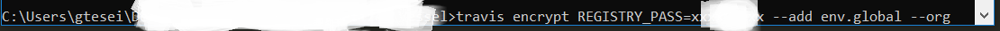

# Patterns_for_Continuous_Integration_Docker_Travis_CI_1


__GOAL__: for each commit on the _master branch_ we want to build a Docker image according to a given Dockerfile and push it on Docker Hub (or different Docker Registry) using Travis CI.

## Dockerfile 

```docker
FROM debian
RUN apt-get update \
    && apt-get install -y --no-install-recommends cowsay \
    && rm -rf /var/lib/apt/lists/*
ENV PATH "$PATH:/usr/games"

ENTRYPOINT ["cowsay"]
CMD ["Hello, World!"]
```

## .travis.yml  

```yml
sudo: required
services:
- docker
env:
  global:
  - REGISTRY_USER=gtesei
  # REGISTRY_PASS=...
    - secret: "<something long>"
before_script:
- docker pull myorg/myimage || true
script:
- docker build --pull --cache-from gtesei/hello_travis --tag gtesei/hello_travis .
- docker run gtesei/hello_travis
after_script:
- docker images
before_deploy:
- docker login -u "$REGISTRY_USER" -p "$REGISTRY_PASS"
deploy:
  provider: script
  script: docker push gtesei/hello_travis
  on:
    branch: master
```


## Howto Encrypt Password of Docker Hub on .travis.yml 


